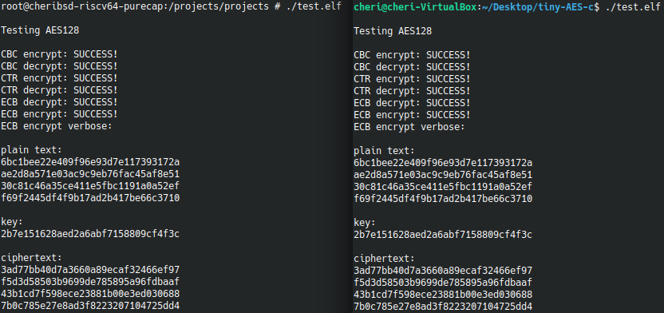

# Implémentation et test de l'AES

Le programme implémenté est un AES classique, disponible à ce [lien](https://github.com/kokke/tiny-AES-c).  
Il permet de compiler un fichier test qui permet de chiffrer un message en CBC,CTR et ECB.

## Cheri RiscV64 purecap

Pour faire fonctionner le programme suivant sous cheri riscv purecap, il a fallu modifier le make, pour rajouter les arguments de cross compilation.  

Ainsi, le fichier make modifié donne :  
```
CC           = ~/cheri/output/sdk/bin/clang
LD           = ~/cheri/output/sdk/bin/clang
AR           = ar
ARFLAGS      = rcs
CFLAGS       = -target riscv64-unknown-freebsd13 --sysroot=/home/cheri/cheri/output/rootfs-riscv64-purecap -B/home/cheri/cheri/output/sdk/bin -march=rv64imafdcxcheri -mabi=l64pc128d -mno-relax -Wall -Os -c
LDFLAGS      = -target riscv64-unknown-freebsd13 --sysroot=/home/cheri/cheri/output/rootfs-riscv64-purecap -B/home/cheri/cheri/output/sdk/bin -march=rv64imafdcxcheri -mabi=l64pc128d -mno-relax -Wall -Os -Wl,-Map,test.map
```
On a modifié le CC et le LD pour sélectionner le clang installé puis on a ajouté les arguments de cross compilation pour les CFLAGS et les LDFLAGS.



### Comparaison temps d'exécution

J'ai ensuite ajouté des fonctions à mon programme afin d'obtenir un temps d'exécution pour comparer la version sous ubuntu et la version sous qemu (cheri riscv).
```c
# include<stdio.h>
# include<time.h>

int main() {
    int number_of_tests=10000;
    clock_t start, end;
    double execution_time=0;
    for(int i=0;i<number_of_tests;i++)
    {
        start = clock();

    /* Put your code here */

        end = clock();
        execution_time += ((double)(end - start))/CLOCKS_PER_SEC;
    }
    execution_time = execution_time/number_of_tests;
    printf("Time taken to execute in seconds : %f\n", execution_time);
```

Pour une exécution sous ubuntu on a le temps d'exécution suivant : (1000) 
```
Time taken to execute in seconds total : 0.064637
Time taken to execute in seconds (for one loop): 0.000065
```  
Pour une exécution sous qemu on a le temps d'exécution suivant :  
```
Time taken to execute in seconds total : 21.054688
Time taken to execute in seconds (for one loop): 0.021055
```  

On peut constater qu'on a un temps d'exécution bien plus long sous cheri riscv. Plusieurs questions sont pertinentent; est-on limité par le nouveau ISA ? Limité car on le fait tourner dans une VM qui n'a peut être pas les même ressources à disposition ? A creuser.  