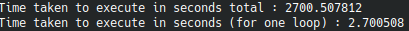

# Algorithme POST QUANTUM : CRYSTALS Kyber

Avec l'arrivée des ordinateurs quantiques, les algorithmees à clé publiques utilisés ne sont plus sur et deviennent facilement cassables avec l'utilisation d'un ordinateur quantique. Pour résoudre à ce problème le NIST (National Institute of Standards and Technology) à ouvert un concours pour trouver des remplacements aux algorithmes à clé publiques actuels (RSA, Diffie Hellman, DSA, ECC).

# Introduction


Kyber est un mécanisme d'encapsulation de clé (KEM) sécurisé par IND-CCA2, dont la sécurité est basée sur la difficulté de résoudre les problèmes d'apprentissage avec erreurs (LWE) sur les treillis de modules. Kyber est l'un des finalistes du projet de cryptographie post-quantique du NIST. La proposition comprend trois différents ensembles de paramètres visant des niveaux de sécurité différents. Plus spécifiquement, Kyber-512 vise une sécurité à peu près équivalente à AES-128, Kyber-768 vise une sécurité à peu près équivalente à AES-192, et Kyber-1024 vise une sécurité à peu près équivalente à AES-256. 

En tant que mise à jour pour le deuxième tour du projet NIST, une variante de Kyber, destinée à démontrer les performances de Kyber lorsque le support matériel des primitives symétriques est disponible, a également été proposée. Cette variante, appelée Kyber-90s, utilise AES-256 en mode compteur et SHA2 au lieu de SHAKE.

Pour les utilisateurs qui souhaitent utiliser Kyber, il est recommandé ce qui suit :
* Utiliser Kyber dans un mode dit hybride en combinaison avec une sécurité "pré-quantique" établie, par exemple en combinaison avec le protocole Diffie-Hellman à courbe elliptique.
* Utiliser le jeu de paramètres Kyber-768, qui, selon une analyse très prudente, offre une sécurité de plus de 128 bits contre toutes les attaques classiques et quantiques connues.

> KEM : Key Encapsulation Mechanism (en français, mécanisme d'encapsulation de clé).  
> IND-CCA2 : Indistinguishability under adaptive Chosen Ciphertext Attack (en français, attaque à texte chiffré choisi).  
> LWE : Learning With Errors (en français, apprentissage avec erreurs).

[Site de l'algorithme](https://pq-crystals.org/kyber/index.shtml)

# Implémentation

|                 | Public Key (Bytes) | Secret Key (Bytes)  | Ciphertext (Bytes) |
|-----------------|--------------------|---------------------|--------------------|
| Kyber-512       | 800                | 1632 (or 32)        | 768                |
| Kyber-512-90s   | 800                | 1632 (or 32)        | 768                |
| Kyber-768       | 1184               | 2400 (or 32)        | 1088               |
| Kyber-768-90s   | 1184               | 2400 (or 32)        | 1088               |
| Kyber-1024      | 1568               | 3168 (or 32)        | 1568               |
| Kyber-1024-90s  | 1568               | 3168 (or 32)        | 1568               |

Known Answer Tests et Code : https://csrc.nist.gov/Projects/post-quantum-cryptography/selected-algorithms-2022

On va utiliser Kyber-512 et Kyber-1024 pour nos tests.

## OpenSSL/conf.h

Installer openssl/conf.h :

``` sh
sudo apt install libssl-dev
```

## Comparaison temps d'exécution

On ajoute des fonctions aux programmes `PQCgenKAT_kem.c` des dossiers `~/Kyber/Reference_Implementation/crypto_kem/kyber512/` et `~/Kyber/Reference_Implementation/crypto_kem/kyber1024/` afin d'obtenir un temps d'exécution pour comparer la version sous ubuntu et la version sous qemu (cheri riscv) :

``` c
#include <stdio.h>
#include <time.h>

int main() {
    int number_of_tests=1000;
    int j=0;
    int k=1;
    clock_t start, end;
    double execution_time=0;
    for(int i=0;i<number_of_tests;i++)
    {
        j++;
        start = clock();

    /* Put your code here */

        end = clock();
        execution_time += ((double)(end - start))/CLOCKS_PER_SEC;
        if ( (j/10) % 5 == 0 && (j/10) % 5 != (k/10) % 5 )
        {
            printf("%d / 100\n", j/10);
        }
        k=j;
    }
    printf("Time taken to execute in seconds total : %f\n", execution_time);
    execution_time = execution_time/number_of_tests;
    printf("Time taken to execute in seconds (for one loop) : %f\n", execution_time);
}
```

## Compilation pour Ubuntu 

### Kyber-512 

On se place dans le dossier `Kyber512` :

``` sh
cd /$HOME/Kyber/Reference_Implementation/crypto_kem/kyber512/
```

On crée un éxecutable `PQCgenKAT_kem` :

``` sh
make
```

On lance l'éxecutable qui va créer deux fichiers (`PQCkemKAT_1632.req` et `PQCkemKAT_1632.rsp`) :

``` sh
./PQCgenKAT_kem
```

On vérifie que les fichiers `PQCkemKAT_1632.req` et `PQCkemKAT_1632.rsp` sont identiques à ceux présents dans le dossier KAT :

``` sh
cmp PQCkemKAT_1632.req /$HOME/Kyber/KAT/kyber512/PQCkemKAT_1632.req
cmp PQCkemKAT_1632.rsp /$HOME/Kyber/KAT/kyber512/PQCkemKAT_1632.rsp
```

---

### Kyber-1024

On se place dans le dossier `Kyber1024` :

``` sh
cd /$HOME/Kyber/Reference_Implementation/crypto_kem/kyber1024/
```

On crée un éxecutable `PQCgenKAT_kem` :

``` sh
make
```

On lance l'éxecutable qui va créer deux fichiers (`PQCkemKAT_3168.req` et `PQCkemKAT_3168.rsp`) :

``` sh
./PQCgenKAT_kem
```

On vérifie que les fichiers `PQCkemKAT_3168.req` et `PQCkemKAT_3168.rsp` sont identiques à ceux présents dans le dossier KAT :

``` sh
cmp PQCkemKAT_3168.req /$HOME/Kyber/KAT/kyber1024/PQCkemKAT_3168.req
cmp PQCkemKAT_3168.rsp /$HOME/Kyber/KAT/kyber1024/PQCkemKAT_3168.rsp
```

## Cross-compilation pour CHERI-RISC-V 

Pour cross-compiler l'algorithme, il faut modifier le fichier `Makefile` qui se trouve dans le dossier de référence.

### Préparation des executables

#### Kyber-512 

On crée une copie du dossier de référence `kyber512` que l'on nomme `kyber512_CHERI-RISC-V`

On modifie le fichier `Makefile` avec les arguments que l'on retrouve dans le fichier `cheribsd-riscv64-purecap.cfg` du dossier `~/cheri/output/sdk/bin/`.

Ce qui donne :

``` sh
CC=/$HOME/cheri/output/sdk/bin/clang
CFLAGS += -O3 -target riscv64-unknown-freebsd13 --sysroot=/$HOME/cheri/output/rootfs-riscv64-purecap -B/$HOME/cheri/output/sdk/bin -march=rv64imafdcxcheri -mabi=l64pc128d -mno-relax
LDFLAGS=-lcrypto

SOURCES= cbd.c fips202.c indcpa.c kem.c ntt.c poly.c polyvec.c PQCgenKAT_kem.c reduce.c rng.c verify.c symmetric-shake.c
HEADERS= api.h cbd.h fips202.h indcpa.h ntt.h params.h poly.h polyvec.h reduce.h rng.h verify.h symmetric.h

PQCgenKAT_kem: $(HEADERS) $(SOURCES)
	$(CC) $(CFLAGS) -o $@ $(SOURCES) $(LDFLAGS)

.PHONY: clean

clean:
	-rm PQCgenKAT_kem
```

On se place dans le dossier `kyber512_CHERI-RISC-V` :

``` sh
cd /$HOME/Kyber/Reference_Implementation/crypto_kem/kyber512_CHERI-RISC-V/
```

On crée un éxecutable `PQCgenKAT_kem` :

``` sh
make
```

On copie le fichier `PQCgenKAT_kem` dans le dossier `~/cheri/output/rootfs-riscv64-purecap/projects/kyber/kyber512_CHERI-RISC-V/` ainsi que les fichiers KAT correspondants (présents dans `~/Kyber/KAT/kyber512/`) dans le dossier `~/cheri/output/rootfs-riscv64-purecap/projects/kyber/KAT/kyber512/`.

---

#### Kyber-1024

On crée une copie du dossier de référence `kyber1024` que l'on nomme `kyber1024_CHERI-RISC-V`

On modifie le fichier `Makefile` avec les arguments que l'on retrouve dans le fichier `cheribsd-riscv64-purecap.cfg` du dossier `~/cheri/output/sdk/bin/`.

Ce qui donne :

``` sh
CC=/$HOME/cheri/output/sdk/bin/clang
CFLAGS += -O3 -target riscv64-unknown-freebsd13 --sysroot=/$HOME/cheri/output/rootfs-riscv64-purecap -B/$HOME/cheri/output/sdk/bin -march=rv64imafdcxcheri -mabi=l64pc128d -mno-relax
LDFLAGS=-lcrypto

SOURCES= cbd.c fips202.c indcpa.c kem.c ntt.c poly.c polyvec.c PQCgenKAT_kem.c reduce.c rng.c verify.c symmetric-shake.c
HEADERS= api.h cbd.h fips202.h indcpa.h ntt.h params.h poly.h polyvec.h reduce.h rng.h verify.h symmetric.h

PQCgenKAT_kem: $(HEADERS) $(SOURCES)
	$(CC) $(CFLAGS) -o $@ $(SOURCES) $(LDFLAGS)

.PHONY: clean

clean:
	-rm PQCgenKAT_kem
```

On se place dans le dossier `kyber1024_CHERI-RISC-V` :

``` sh
cd /$HOME/Kyber/Reference_Implementation/crypto_kem/kyber1024_CHERI-RISC-V/
```

On crée un éxecutable `PQCgenKAT_kem` :

``` sh
make
```

On copie le fichier `PQCgenKAT_kem` dans le dossier `~/cheri/output/rootfs-riscv64-purecap/projects/kyber/kyber1024_CHERI-RISC-V/` ainsi que les fichiers KAT correspondants (présents dans `~/Kyber/KAT/kyber1024/`) dans le dossier `~/cheri/output/rootfs-riscv64-purecap/projects/kyber/KAT/kyber1024/`.

---

### Nouvelle image disque

On construie une nouvelle image CheriBSD pour l'architecture CHERI-RISC-V en incluant les nouveau fichiers :

``` sh
./cheribuild.py disk-image-riscv64-purecap
```

### Connection CHERISBD

on lance une VM de CheriBSD sous CHERI-RISC-V :

``` sh
./cheribuild.py run-riscv64-purecap
```

On se connecte avec les identifiants :

login : root  
pas de mot de passe

### Création des fichiers KAT

On exécute les fichiers `PQCgenKAT_kem` présents dans les dossier `~/projects/kyber/kyber512_CHERI-RISC-V/` et `~/projects/kyber/kyber1024_CHERI-RISC-V/` :

``` sh
cd ../projects/kyber/kyber512_CHERI-RISC-V/
./PQCgenKAT_kem
cd ../kyber1024_CHERI-RISC-V/
./PQCgenKAT_kem
```

### Vérification

On vérifie que les fichiers `PQCkemKAT_1632.req`, `PQCkemKAT_1632.rsp`, `PQCkemKAT_3168.req` et `PQCkemKAT_3168.rsp` sont identiques à ceux présents dans le dossier KAT :

``` sh
cd ../kyber512_CHERI-RISC-V/
cmp PQCkemKAT_1632.req /projects/kyber/KAT/kyber512/PQCkemKAT_1632.req
cmp PQCkemKAT_1632.rsp /projects/kyber/KAT/kyber512/PQCkemKAT_1632.rsp
cd ../kyber1024_CHERI-RISC-V/
cmp PQCkemKAT_3168.req /projects/kyber/KAT/kyber1024/PQCkemKAT_3168.req
cmp PQCkemKAT_3168.rsp /projects/kyber/KAT/kyber1024/PQCkemKAT_3168.rsp
```
---

## Cross-compilation pour RISC-V 

Pour cross-compiler l'algorithme, il faut modifier le fichier `Makefile` qui se trouve dans le dossier de référence.

### Préparation des executables

#### Kyber-512 

On crée une copie du dossier de référence `kyber512` que l'on nomme `kyber512_RISC-V`

On modifie le fichier `Makefile` avec les arguments que l'on retrouve dans le fichier `cheribsd-riscv64.cfg` du dossier `~/cheri/output/sdk/bin/`.

Ce qui donne :

``` sh
CC=/$HOME/cheri/output/sdk/bin/clang
CFLAGS += -O3 -target riscv64-unknown-freebsd13 --sysroot=/$HOME/cheri/output/rootfs-riscv64 -B/$HOME/cheri/output/sdk/bin -march=rv64imafdc -mabi=lp64d -mno-relax
LDFLAGS=-lcrypto

SOURCES= cbd.c fips202.c indcpa.c kem.c ntt.c poly.c polyvec.c PQCgenKAT_kem.c reduce.c rng.c verify.c symmetric-shake.c
HEADERS= api.h cbd.h fips202.h indcpa.h ntt.h params.h poly.h polyvec.h reduce.h rng.h verify.h symmetric.h

PQCgenKAT_kem: $(HEADERS) $(SOURCES)
	$(CC) $(CFLAGS) -o $@ $(SOURCES) $(LDFLAGS)

.PHONY: clean

clean:
	-rm PQCgenKAT_kem
```

On se place dans le dossier `kyber512_RISC-V` :

``` sh
cd /$HOME/Kyber/Reference_Implementation/crypto_kem/kyber512_RISC-V/
```

On crée un éxecutable `PQCgenKAT_kem` :

``` sh
make
```

On copie le fichier `PQCgenKAT_kem` dans le dossier `~/cheri/output/rootfs-riscv64/projects/kyber/kyber512_RISC-V/` ainsi que les fichiers KAT correspondants (présents dans `~/Kyber/KAT/kyber512/`) dans le dossier `~/cheri/output/rootfs-riscv64/projects/kyber/KAT/kyber512/`.

---

#### Kyber-1024

On crée une copie du dossier de référence `kyber1024` que l'on nomme `kyber1024_RISC-V`

On modifie le fichier `Makefile` avec les arguments que l'on retrouve dans le fichier `cheribsd-riscv64.cfg` du dossier `~/cheri/output/sdk/bin/`.

Ce qui donne :

``` sh
CC=/$HOME/cheri/output/sdk/bin/clang
CFLAGS += -O3 -target riscv64-unknown-freebsd13 --sysroot=/$HOME/cheri/output/rootfs-riscv64 -B/$HOME/cheri/output/sdk/bin -march=rv64imafdc -mabi=lp64d -mno-relax
LDFLAGS=-lcrypto

SOURCES= cbd.c fips202.c indcpa.c kem.c ntt.c poly.c polyvec.c PQCgenKAT_kem.c reduce.c rng.c verify.c symmetric-shake.c
HEADERS= api.h cbd.h fips202.h indcpa.h ntt.h params.h poly.h polyvec.h reduce.h rng.h verify.h symmetric.h

PQCgenKAT_kem: $(HEADERS) $(SOURCES)
	$(CC) $(CFLAGS) -o $@ $(SOURCES) $(LDFLAGS)

.PHONY: clean

clean:
	-rm PQCgenKAT_kem
```

On se place dans le dossier `kyber1024_RISC-V` :

``` sh
cd /$HOME/Kyber/Reference_Implementation/crypto_kem/kyber1024_RISC-V/
```

On crée un éxecutable `PQCgenKAT_kem` :

``` sh
make
```

On copie le fichier `PQCgenKAT_kem` dans le dossier `~/cheri/output/rootfs-riscv64/projects/kyber/kyber1024_RISC-V/` ainsi que les fichiers KAT correspondants (présents dans `~/Kyber/KAT/kyber1024/`) dans le dossier `~/cheri/output/rootfs-riscv64/projects/kyber/KAT/kyber1024/`.

---

### Nouvelle image disque

On construie une nouvelle image CheriBSD pour l'architecture RISC-V en incluant les nouveau fichiers :

``` sh
./cheribuild.py disk-image-riscv64
```

### Connection CHERISBD

on lance une VM de CheriBSD sous RISC-V :

``` sh
./cheribuild.py run-riscv64
```

On se connecte avec les identifiants :

login : root  
pas de mot de passe

### Création des fichiers KAT

On exécute les fichiers `PQCgenKAT_kem` présents dans les dossier `~/projects/kyber/kyber512_RISC-V/` et `~/projects/kyber/kyber1024_RISC-V/` :

``` sh
cd ../projects/kyber/kyber512_RISC-V/
./PQCgenKAT_kem
cd ../kyber1024_RISC-V/
./PQCgenKAT_kem
```

### Vérification

On vérifie que les fichiers `PQCkemKAT_1632.req`, `PQCkemKAT_1632.rsp`, `PQCkemKAT_3168.req` et `PQCkemKAT_3168.rsp` sont identiques à ceux présents dans le dossier KAT :

``` sh
cd ../kyber512_RISC-V/
cmp PQCkemKAT_1632.req /projects/kyber/KAT/kyber512/PQCkemKAT_1632.req
cmp PQCkemKAT_1632.rsp /projects/kyber/KAT/kyber512/PQCkemKAT_1632.rsp
cd ../kyber1024_RISC-V/
cmp PQCkemKAT_3168.req /projects/kyber/KAT/kyber1024/PQCkemKAT_3168.req
cmp PQCkemKAT_3168.rsp /projects/kyber/KAT/kyber1024/PQCkemKAT_3168.rsp
```

# Résultat

Pour les tests, l'algorithme a été utilisé 1000 fois pour obtenir un temps moyen proche de la réalité, ces tests ont été réalisés sous Ubuntu (VirtualBox), sous RISC-V (QEMU) et sous CHERI-RISC-V (QEMU) en utilisant les algorithmes CRYSTALS Kyber 512 et CRYSTALS Kyber 1024.

Il faut prendre en compte que la VM Ubuntu dispose de plus de puissance de calcul que les VM QEMU (RISC-V et CHERI-RISC-V) qui, elles, ont la même puissance à disposition.

## Ubuntu 

### Kyber 512


**0,036 secondes** pour l'éxecution de l'algorithme sous Ubuntu.  

### Kyber 1024


**0,070 secondes** pour l'éxecution de l'algorithme sous Ubuntu.  

## RISC-V 

### Kyber 512


**1,324 secondes** pour l'éxecution de l'algorithme sous RISC-V.  

### Kyber 1024



**2,701 secondes** pour l'éxecution de l'algorithme sous RISC-V.  

## CHERI-RISC-V 

### Kyber 512


**4,928 secondes** pour l'éxecution de l'algorithme sous CHERI-RISC-V.  
(**+ 13 589 %** de temps ou **136,89 fois plus** de temps que sous Ubuntu)  
(**+ 272 %** de temps ou **3,72 fois plus** de temps que sous RISC-V)

### Kyber 1024


**10,290 secondes** pour l'éxecution de l'algorithme sous CHERI-RISC-V.  
(**+ 14 600 %** de temps ou **147 fois plus** de temps que sous Ubuntu)  
(**+ 281 % de temps** ou **3,81 fois plus** de temps que sous RISC-V)

---

J'en déduis que l'utilisation des Capalibities pour les algorithmes CRYSTALS Kyber multiplie le temps d'exécution par quatre.