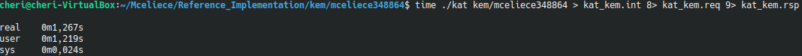
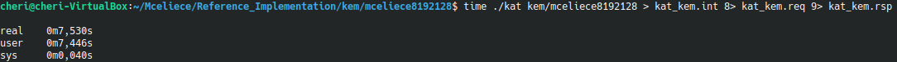
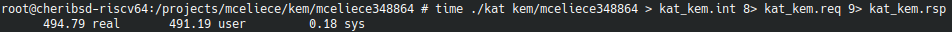
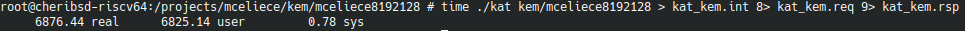
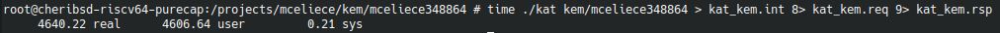
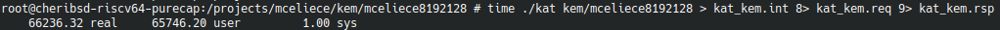

# Algorithme POST QUANTUM 2 : Classic McEliece

Avec l'arrivée des ordinateurs quantiques, les algorithmees à clé publiques utilisés ne sont plus sur et deviennent facilement cassables avec l'utilisation d'un ordinateur quantique. Pour résoudre à ce problème le NIST (National Institute of Standards and Technology) à ouvert un concours pour trouver des remplacements aux algorithmes à clé publiques actuels (RSA, Diffie Hellman, DSA, ECC).

# Introduction

McEliece est un chiffrement à clé publique inventé en 1978. C'était un des premiers programmes a utiliser de l'aléatoire dans le chiffrement. Il a été rarement utilisé dans la pratique en raison d'une clé de chiffrement particulièrement grande et un message chiffré bien plus long que l'original. 

Il repose sur un problème très différent des algorithmes asymétriques (factorisation) et n'est donc pas affecté par la percée dans ce domaine des ordinateurs quantiques.

Il a donc été amélioré et utilisé pour le NIST.

"
Classic McEliece brings all of this together. It is a KEM designed for IND-CCA2 security at a very high security level, even against quantum computers. The KEM is built conservatively from a PKE designed for OW-CPA security, namely Niederreiter's dual version of McEliece's PKE using binary Goppa codes. Every level of the construction is designed so that future cryptographic auditors can be confident in the long-term security of post-quantum public-key encryption.
"  

> KEM : Key Encapsulation Mechanism (mécanisme d'encapsulation de clé).  
> IND-CCA2 : Indistinguishability under adaptive Chosen Ciphertext Attack (attaque à texte chiffré choisi).  
> PKE : Public Key Encryption (cryptage à clé publique).
> OW-CPA : One-Wayness Against Chosen-Plaintext Attack (Résistance à l'attaque par le texte choisi).

[Site de l'algorithme](https://classic.mceliece.org/)

# Implémentation


|                   | Public Key | Private Key | Ciphertext | Session key |
|-------------------|------------|-------------|------------|-------------|
| mceliece348864    | 261120     | 6492        | 96         | 32          |
| mceliece348864f   | 261120     | 6492        | 96         | 32          |
| mceliece460896    | 524160     | 13608       | 156        | 32          |
| mceliece460896f   | 524160     | 13608       | 156        | 32          |
| mceliece6688128   | 1044992    | 13932       | 208        | 32          |
| mceliece6688128f  | 1044992    | 13932       | 208        | 32          |
| mceliece6960119   | 1047319    | 13948       | 194        | 32          |
| mceliece6960119f  | 1047319    | 13948       | 194        | 32          |
| mceliece8192128   | 1357824    | 14120       | 208        | 32          |
| mceliece8192128f  | 1357824    | 14120       | 208        | 32          |

Known Answer Tests et Code : https://csrc.nist.gov/Projects/post-quantum-cryptography/round-4-submissions

On va utiliser le mceliece348864 et le mceliece8192128 pour nos tests.

## OpenSSL/conf.h

Installer openssl/conf.h :

``` sh
sudo apt install libssl-dev
```

## Keccak

Récupérer le fichier ZIP de ce repository : [Keccak.zip](https://github.com/AlexandreMoG/comparison-secured-riscv-targets/raw/master/Implementation_VM/Implementation_Classic_McEliece/Keccak.zip).

Extraire le fichier `Keccak.zip` et placer le dossier `Keccak` dans le dossier de l'algorithme à cross-compiler (exemple : `/McEliece/kem/mceliece8192128/Keccak`).

Ajouter le fichier header nécessaire à l'éxecution de l'algorithme dans `crypto_hash.h` :

``` h
#include "Keccak/SimpleFIPS202.h"

#define crypto_hash_32b(out,in,inlen) \
  SHAKE256(out,32,in,inlen)

#define shake(out,outlen,in,inlen) \
  SHAKE256(out,outlen,in,inlen)
```

Remplacer `-lkeccak` dans le script `build` par :

``` sh
Keccak/SimpleFIPS202.c Keccak/KeccakSponge.c Keccak/KeccakP-1600-compact64.c
```

## Compilation pour Ubuntu 

### McEliece-348864

On se place dans le dossier `mceliece348864` :

``` sh
cd /$HOME/Mceliece/Reference_Implementation/kem/mceliece348864/
```

On crée un éxecutable `kat` :

``` sh
./build
```

On lance l'éxecutable qui va créer trois fichiers (`kat_kem.int`, `kat_kem.req` et `kat_kem.rsp`) :

``` sh
time ./kat kem/mceliece348864 > kat_kem.int 8> kat_kem.req 9> kat_kem.rsp 
```

On vérifie que les fichiers `kat_kem.int`, `kat_kem.req` et `kat_kem.rsp` sont identiques à ceux présents dans le dossier KAT :

``` sh
cmp kat_kem.int /$HOME/Mceliece/KAT/kem/mceliece348864/kat_kem.int
cmp kat_kem.req /$HOME/Mceliece/KAT/kem/mceliece348864/kat_kem.req
cmp kat_kem.rsp /$HOME/Mceliece/KAT/kem/mceliece348864/kat_kem.rsp
```

---

### McEliece-8192128

On se place dans le dossier `mceliece8192128` :

``` sh
cd /$HOME/Mceliece/Reference_Implementation/kem/mceliece8192128/
```

On crée un éxecutable `kat` :

``` sh
./build
```

On lance l'éxecutable qui va créer trois fichiers (`kat_kem.int`, `kat_kem.req` et `kat_kem.rsp`) :

``` sh
time ./kat kem/mceliece8192128 > kat_kem.int 8> kat_kem.req 9> kat_kem.rsp
```

On vérifie que les fichiers `kat_kem.int`, `kat_kem.req` et `kat_kem.rsp` sont identiques à ceux présents dans le dossier KAT :

``` sh
cmp kat_kem.int /$HOME/Mceliece/KAT/kem/mceliece8192128/kat_kem.int
cmp kat_kem.req /$HOME/Mceliece/KAT/kem/mceliece8192128/kat_kem.req
cmp kat_kem.rsp /$HOME/Mceliece/KAT/kem/mceliece8192128/kat_kem.rsp
```

## Cross-compilation pour CHERI-RISC-V 


Pour cross-compiler l'algorithme, il faut modifier le fichier `build` qui se trouve dans le dossier de référence.

### Préparation des executables

#### McEliece-348864

On crée une copie du dossier de référence `mceliece348864` que l'on nomme `mceliece348864_CHERI-RISC-V`

On modifie le fichier `build` avec les arguments que l'on retrouve dans le fichier `cheribsd-riscv64-purecap.cfg` du dossier `~/cheri/output/sdk/bin/`.

Ce qui donne :

``` sh
#!/bin/sh
~/cheri/output/sdk/bin/clang -target riscv64-unknown-freebsd13 --sysroot=/home/cheri/cheri/output/rootfs-riscv64-purecap -B/home/cheri/cheri/output/sdk/bin -march=rv64imafdcxcheri -mabi=l64pc128d -mno-relax -Wall -Wextra -Wno-unused-function -Wno-unused-parameter -Wno-sign-compare -I. -Isubroutines -DKAT -DKATNUM=`cat KATNUM` "-DCRYPTO_NAMESPACE(x)=x" "-D_CRYPTO_NAMESPACE(x)=_##x" -o kat nist/kat_kem.c nist/rng.c benes.c bm.c controlbits.c decrypt.c encrypt.c gf.c operations.c pk_gen.c root.c sk_gen.c synd.c transpose.c util.c Keccak/SimpleFIPS202.c Keccak/KeccakSponge.c Keccak/KeccakP-1600-compact64.c -lcrypto -ldl 
```

On se place dans le dossier `mceliece348864_CHERI-RISC-V` :

``` sh
cd /$HOME/Mceliece/Reference_Implementation/kem/mceliece348864_CHERI-RISC-V/
```

On crée un éxecutable `kat` :

``` sh
make
```

On copie le fichier `kat` dans le dossier `~/cheri/output/rootfs-riscv64-purecap/projects/mceliece/kem/mceliece348864_CHERI-RISC-V/` ainsi que les fichiers KAT correspondants (présents dans `~/Mceliece/KAT/kem/mceliece348864/`) dans le dossier `~/cheri/output/rootfs-riscv64-purecap/projects/mceliece/KAT/mceliece348864/`.

---

#### McEliece-8192128

On crée une copie du dossier de référence `mceliece8192128` que l'on nomme `mceliece8192128_CHERI-RISC-V`

On modifie le fichier `build` avec les arguments que l'on retrouve dans le fichier `cheribsd-riscv64-purecap.cfg` du dossier `~/cheri/output/sdk/bin/`.

Ce qui donne :

``` sh
#!/bin/sh
~/cheri/output/sdk/bin/clang -target riscv64-unknown-freebsd13 --sysroot=/home/cheri/cheri/output/rootfs-riscv64-purecap -B/home/cheri/cheri/output/sdk/bin -march=rv64imafdcxcheri -mabi=l64pc128d -mno-relax -Wall -Wextra -Wno-unused-function -Wno-unused-parameter -Wno-sign-compare -I. -Isubroutines -DKAT -DKATNUM=`cat KATNUM` "-DCRYPTO_NAMESPACE(x)=x" "-D_CRYPTO_NAMESPACE(x)=_##x" -o kat nist/kat_kem.c nist/rng.c benes.c bm.c controlbits.c decrypt.c encrypt.c gf.c operations.c pk_gen.c root.c sk_gen.c synd.c transpose.c util.c Keccak/SimpleFIPS202.c Keccak/KeccakSponge.c Keccak/KeccakP-1600-compact64.c -lcrypto -ldl 
```

On se place dans le dossier `mceliece8192128_CHERI-RISC-V` :

``` sh
cd /$HOME/Mceliece/Reference_Implementation/kem/mceliece8192128_CHERI-RISC-V/
```

On crée un éxecutable `kat` :

``` sh
make
```

On copie le fichier `kat` dans le dossier `~/cheri/output/rootfs-riscv64-purecap/projects/mceliece/kem/mceliece8192128_CHERI-RISC-V/` ainsi que les fichiers KAT correspondants (présents dans `~/Mceliece/KAT/kem/mceliece8192128/`) dans le dossier `~/cheri/output/rootfs-riscv64-purecap/projects/mceliece/KAT/mceliece8192128/`.

---

### Nouvelle image disque

On construie une nouvelle image CheriBSD pour l'architecture CHERI-RISC-V en incluant les nouveau fichiers :

``` sh
./cheribuild.py disk-image-riscv64-purecap
```

### Connection CHERISBD

on lance une VM de CheriBSD sous CHERI-RISC-V :

``` sh
./cheribuild.py run-riscv64-purecap
```

On se connecte avec les identifiants :

login : root  
pas de mot de passe

### Création des fichiers KAT

On exécute les fichiers `kat` présents dans les dossiers `~/projects/mceliece/kem/mceliece348864_CHERI-RISC-V/` et `~/projects/mceliece/kem/mceliece8192128_CHERI-RISC-V/` :

``` sh
cd ../projects/mceliece/kem/mceliece348864_CHERI-RISC-V/
time ./kat kem/mceliece348864_CHERI-RISC-V > kat_kem.int 8> kat_kem.req 9> kat_kem.rsp
cd ../mceliece8192128_CHERI-RISC-V/
time ./kat kem/mceliece8192128_CHERI-RISC-V > kat_kem.int 8> kat_kem.req 9> kat_kem.rsp
```

### Vérification

On vérifie que les fichiers `kat_kem.int`, `kat_kem.req` et `kat_kem.rsp` sont identiques à ceux présents dans les dossiers KAT respéctifs :

``` sh
cd ../mceliece348864_CHERI-RISC-V/
cmp kat_kem.int /projects/mceliece/KAT/mceliece348864/kat_kem.int
cmp kat_kem.req /projects/mceliece/KAT/mceliece348864/kat_kem.req
cmp kat_kem.rsp /projects/mceliece/KAT/mceliece348864/kat_kem.rsp
cd ../mceliece8192128_CHERI-RISC-V/
cmp kat_kem.int /projects/mceliece/KAT/mceliece8192128/kat_kem.int
cmp kat_kem.req /projects/mceliece/KAT/mceliece8192128/kat_kem.req
cmp kat_kem.rsp /projects/mceliece/KAT/mceliece8192128/kat_kem.rsp
```
---

## Cross-compilation pour RISC-V 

Pour cross-compiler l'algorithme, il faut modifier le fichier `build` qui se trouve dans le dossier de référence.

### Préparation des executables

#### McEliece-348864 

On crée une copie du dossier de référence `mceliece348864` que l'on nomme `mceliece348864_RISC-V`

On modifie le fichier `build` avec les arguments que l'on retrouve dans le fichier `cheribsd-riscv64.cfg` du dossier `~/cheri/output/sdk/bin/`.

Ce qui donne :

``` sh
#!/bin/sh
~/cheri/output/sdk/bin/clang -target riscv64-unknown-freebsd13 --sysroot=/home/cheri/cheri/output/rootfs-riscv64 -B/home/cheri/cheri/output/sdk/bin -march=rv64imafdc -mabi=lp64d -mno-relax -Wall -Wextra -Wno-unused-function -Wno-unused-parameter -Wno-sign-compare -I. -Isubroutines -DKAT -DKATNUM=`cat KATNUM` "-DCRYPTO_NAMESPACE(x)=x" "-D_CRYPTO_NAMESPACE(x)=_##x" -o kat nist/kat_kem.c nist/rng.c benes.c bm.c controlbits.c decrypt.c encrypt.c gf.c operations.c pk_gen.c root.c sk_gen.c synd.c transpose.c util.c Keccak/SimpleFIPS202.c Keccak/KeccakSponge.c Keccak/KeccakP-1600-compact64.c -lcrypto -ldl
```

On se place dans le dossier `mceliece348864_RISC-V` :

``` sh
cd /$HOME/Mceliece/Reference_Implementation/kem/mceliece348864_RISC-V/
```

On crée un éxecutable `kat` :

``` sh
make
```

On copie le fichier `kat` dans le dossier `~/cheri/output/rootfs-riscv64/projects/mceliece/kem/mceliece348864_RISC-V/` ainsi que les fichiers KAT correspondants (présents dans `~/Mceliece/KAT/kem/mceliece348864/`) dans le dossier `~/cheri/output/rootfs-riscv64/projects/mceliece/KAT/mceliece348864/`.

---

#### McEliece-8192128

On crée une copie du dossier de référence `mceliece8192128` que l'on nomme `mceliece8192128_RISC-V`

On modifie le fichier `build` avec les arguments que l'on retrouve dans le fichier `cheribsd-riscv64.cfg` du dossier `~/cheri/output/sdk/bin/`.

Ce qui donne :

``` sh
#!/bin/sh
~/cheri/output/sdk/bin/clang -target riscv64-unknown-freebsd13 --sysroot=/home/cheri/cheri/output/rootfs-riscv64 -B/home/cheri/cheri/output/sdk/bin -march=rv64imafdc -mabi=lp64d -mno-relax -Wall -Wextra -Wno-unused-function -Wno-unused-parameter -Wno-sign-compare -I. -Isubroutines -DKAT -DKATNUM=`cat KATNUM` "-DCRYPTO_NAMESPACE(x)=x" "-D_CRYPTO_NAMESPACE(x)=_##x" -o kat nist/kat_kem.c nist/rng.c benes.c bm.c controlbits.c decrypt.c encrypt.c gf.c operations.c pk_gen.c root.c sk_gen.c synd.c transpose.c util.c Keccak/SimpleFIPS202.c Keccak/KeccakSponge.c Keccak/KeccakP-1600-compact64.c -lcrypto -ldl
```

On se place dans le dossier `mceliece8192128_RISC-V` :

``` sh
cd /$HOME/Mceliece/Reference_Implementation/kem/mceliece8192128_RISC-V/
```

On crée un éxecutable `kat` :

``` sh
make
```

On copie le fichier `kat` dans le dossier `~/cheri/output/rootfs-riscv64/projects/mceliece/kem/mceliece8192128_RISC-V/` ainsi que les fichiers KAT correspondants (présents dans `~/Mceliece/KAT/kem/mceliece8192128/`) dans le dossier `~/cheri/output/rootfs-riscv64/projects/mceliece/KAT/mceliece8192128/`.

---

### Nouvelle image disque

On construie une nouvelle image CheriBSD pour l'architecture RISC-V en incluant les nouveau fichiers :

``` sh
./cheribuild.py disk-image-riscv64
```

### Connection CHERISBD

on lance une VM de CheriBSD sous RISC-V :

``` sh
./cheribuild.py run-riscv64
```

On se connecte avec les identifiants :

login : root  
pas de mot de passe

### Création des fichiers KAT

On exécute les fichiers `kat` présents dans les dossiers `~/projects/mceliece/kem/mceliece348864_RISC-V/` et `~/projects/mceliece/kem/mceliece8192128_RISC-V/` :

``` sh
cd ../projects/mceliece/mceliece348864_RISC-V/
time ./kat kem/mceliece348864_RISC-V > kat_kem.int 8> kat_kem.req 9> kat_kem.rsp
cd ../mceliece8192128_RISC-V/
time ./kat kem/mceliece8192128_RISC-V > kat_kem.int 8> kat_kem.req 9> kat_kem.rsp
```

### Vérification

On vérifie que les fichiers `kat_kem.int`, `kat_kem.req` et `kat_kem.rsp` sont identiques à ceux présents dans les dossiers KAT respéctifs :

``` sh
cd ../mceliece348864_RISC-V/
cmp kat_kem.int /projects/mceliece/KAT/mceliece348864/kat_kem.int
cmp kat_kem.req /projects/mceliece/KAT/mceliece348864/kat_kem.req
cmp kat_kem.rsp /projects/mceliece/KAT/mceliece348864/kat_kem.rsp
cd ../mceliece8192128_RISC-V/
cmp kat_kem.int /projects/mceliece/KAT/mceliece8192128/kat_kem.int
cmp kat_kem.req /projects/mceliece/KAT/mceliece8192128/kat_kem.req
cmp kat_kem.rsp /projects/mceliece/KAT/mceliece8192128/kat_kem.rsp
```

# Résultat

Pour les tests, l'algorithme a été utilisé 1 seul fois car le temps d'exécution est très long. Ces tests ont été réalisés sous Ubuntu (VirtualBox), sous RISC-V (QEMU) et sous CHERI-RISC-V (QEMU) en utilisant les algorithmes Classic McEliece-348864 et Classic McEliece-8192128.

Il faut prendre en compte que la VM Ubuntu dispose de plus de puissance de calcul que les VM QEMU (RISC-V et CHERI-RISC-V) qui, elles, ont la même puissance à disposition.

## Ubuntu 

### McEliece-348864



**1,267 secondes** pour l'éxecution de l'algorithme sous Ubuntu.  

### McEliece-8192128



**7,530 secondes** pour l'éxecution de l'algorithme sous Ubuntu.  

## RISC-V 

### McEliece-348864



**494 secondes** pour l'éxecution de l'algorithme sous RISC-V.  

### McEliece-8192128



**6 876 secondes** pour l'éxecution de l'algorithme sous RISC-V.  

## CHERI-RISC-V 

### McEliece-348864



**4 640 secondes** pour l'éxecution de l'algorithme sous CHERI-RISC-V.  
(**+ 366 119 %** de temps ou **3 662,19 fois plus** de temps que sous Ubuntu)  
(**+ 839 %** de temps ou **9,39 fois plus** de temps que sous RISC-V)

### McEliece-8192128



**66 236 secondes** pour l'éxecution de l'algorithme sous CHERI-RISC-V.  
(**+ 879 528 %** de temps ou **8 796,28 fois plus** de temps que sous Ubuntu)  
(**+ 863 % de temps** ou **9,63 fois plus** de temps que sous RISC-V)

---

J'en déduis que l'utilisation des Capalibities pour les algorithmes Classic McEliece multiplie le temps d'exécution par dix.